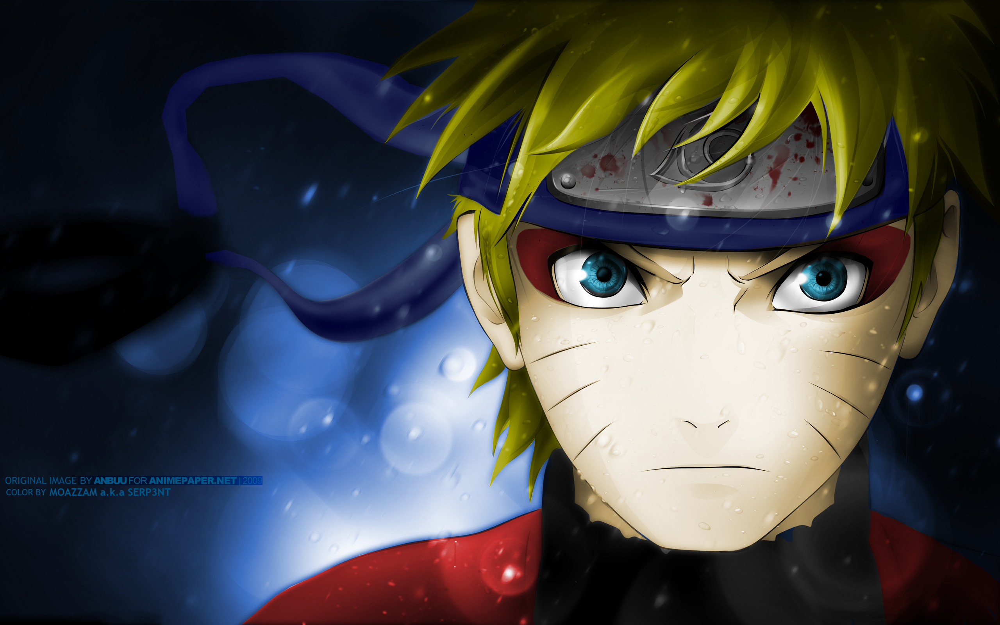

<!DOCTYPE html>
<html lang="en">
<head>
    <meta charset="UTF-8">
    <meta name="viewport" content="width=device-width, initial-scale=1.0">
    <title>Tribute to Naruto</title>
    <link rel="stylesheet" href="naruto.css">
    

</head>
<body>
   <h1 >Naruto Uzumaki</h1>
   <h3>"I Will never give up on my ninja way"</h3>
   
   
Naruto Uzumaki, a central figure in the captivating world of anime and manga, is a character whose qualities resonate deeply with audiences. His unyielding determination to surmount any obstacle, regardless of its magnitude, stands as a testament to his unwavering resolve. This attribute is closely intertwined with his courageous nature, as he fearlessly confronts challenges head-on, demonstrating remarkable bravery even when faced with insurmountable odds.
 
   
Naruto's heart is as expansive as his dreams, exemplifying a truly kind-hearted soul that extends compassion and assistance to others, irrespective of their attitudes toward him. His journey from a challenging upbringing only highlights his resilience, his capacity to rise above adversity and emerge stronger. Central to his character is his loyalty—a steadfast commitment to his friends and village, reflecting a bond that remains unbreakable.
 
   
An eternal optimist, Naruto radiates positivity, a trait that uplifts those around him and fosters a hopeful atmosphere. His boundless energy infuses vitality into every scene, establishing him as a charismatic and infectious presence. Beyond his personal struggles, Naruto is an inspiring figure, illustrating how perseverance, hard work, and an indomitable spirit can pave the path to greatness.
 
   
With an insatiable thirst for adventure, Naruto embodies an adventurous spirit, eager to explore new horizons and confront the unknown. His tenacity shines through as he maintains a never-give-up attitude, continually pursuing his goals despite setbacks. Naruto Uzumaki's character encapsulates an array of admirable traits that have not only endeared him to fans but also solidified his status as an iconic figure in the world of fiction, leaving an enduring impact that transcends the confines of his animated existence.
 
</body>
</html>
